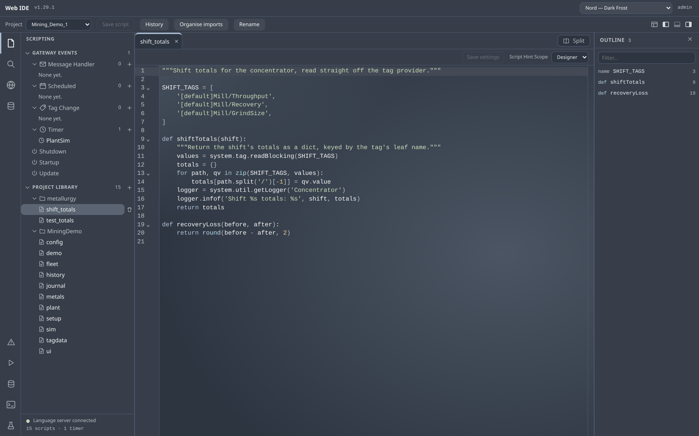
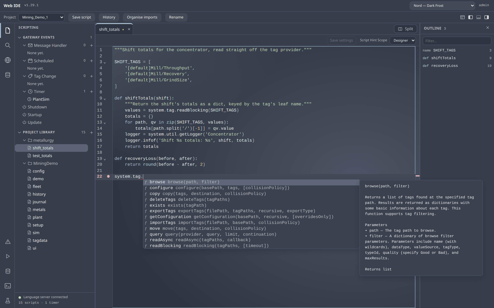
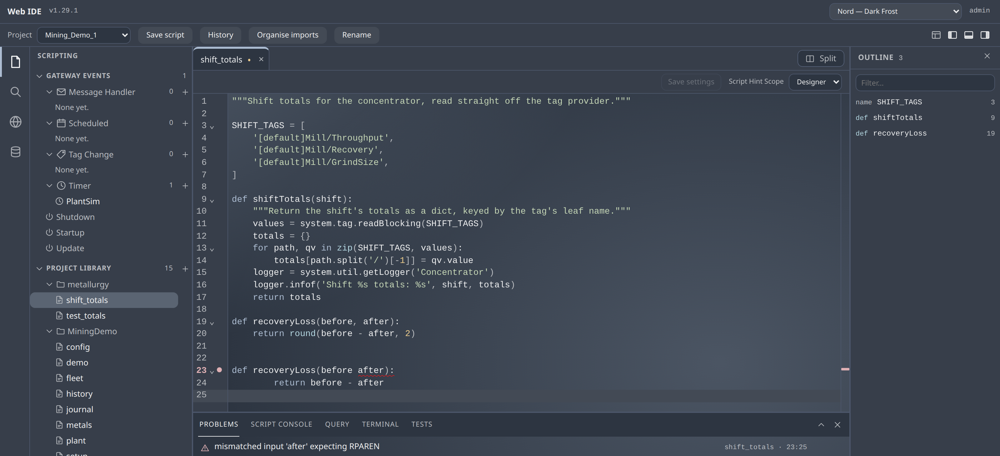
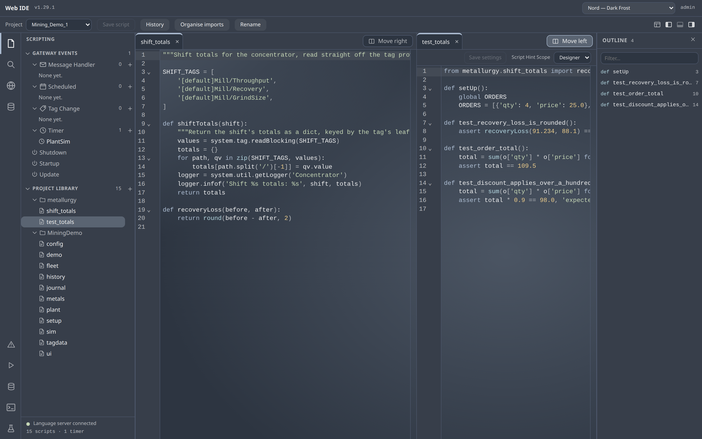
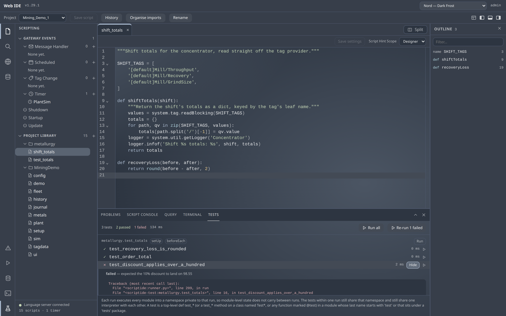
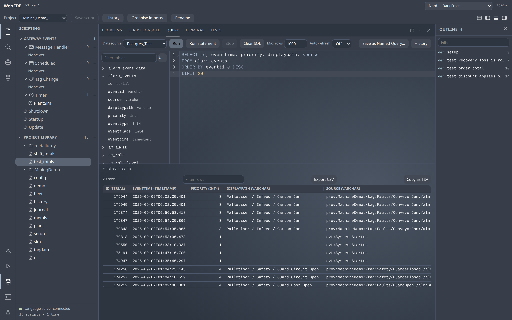
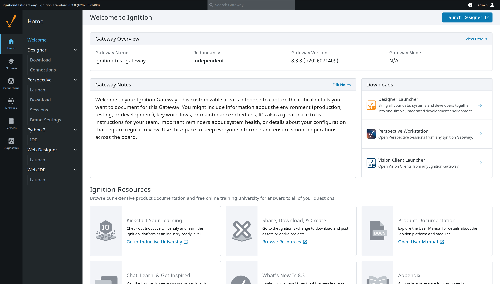

# Web IDE for Ignition

Write Ignition scripts in a real editor, in the browser, against the live gateway.

> **Not an Inductive Automation product, and not supported by Inductive Automation.** Independent work, largely built with AI tools and tested for one purpose on a limited subset of gateway versions and platforms. Take the ideas; fork and review it before it goes near production. Feedback is welcome in Issues; improvements are made where possible, but no support is guaranteed. [NOTICE.md](NOTICE.md) says more.

**Module ID**: `com.gaskony.scriptide` · Ignition 8.3+

---

## Why this exists

Ignition's Designer ships a script editor that amounts to syntax highlighting
and a completion popup in a Swing text area. Anyone who writes Python anywhere
else expects go-to-definition, symbol search, errors before you save, and a
console that runs what you just wrote.

So the gap is real, and it is worth filling from the other side: not "bring
your project to your IDE", but **bring a real IDE to the gateway** — no
install, no Designer, reading the API of the gateway that is actually running.

## What it looks like


*Editing a project library script. The left rail groups scripts by type and marks
inherited resources; the footer shows whether the language server is connected.*


*Completions come from **the gateway you are connected to** — real parameter names,
defaults and documentation, including functions from whichever modules that gateway
actually has installed. No static stub file can know that.*


*Errors are checked by the gateway's own Jython 2.7 parser, so Python-2 code —
`print "x"`, `except E, e:`, `10L` — is never wrongly flagged.*


*Two scripts at once, in one window. Either pane can hold any open document, the
divider is draggable, and Ctrl+\\ splits and collapses it.*


*Jython tests, discovered and run on the gateway. A failure and an error are kept
apart: an error never got far enough to have an opinion.*


*Ad hoc SQL against any configured datasource. The schema tree browses tables and
columns without leaving the query, and Copy as TSV pastes a result grid straight
into a spreadsheet.*


*It appears on the Gateway home page like any other module.*

## What it does

| Area | What it does |
| --- | --- |
| Editing | Project Library and Gateway event scripts (timer, message, startup, shutdown, scheduled, tag change), written through the platform's own resource API — no file stamping, no project scan |
| Execution | Run a buffer, a selection, or the active tab on the gateway, against the console's own project picker (independent of whichever project the IDE has open); streamed output, real tracebacks that open the failing frame, best-effort Stop, per-user isolation |
| Intelligence | Autocomplete and signature help from the running gateway's script registry; live error checking against the real Jython parser for Python, and CSS/JS/JSON/SQL/HTML by their own parsers |
| Navigation | Outline, go to definition (F12), quick open (Ctrl+P), project-wide search and replace, name-based find-references (Shift+F12), a Problems panel |
| Web Dev | All eight HTTP methods per endpoint, per-method settings, create and delete, plus the endpoint's static HTML/JS/CSS files |
| Database Query Browser | Pick a datasource, browse its schema-qualified tables and columns, and run ad hoc SQL with dialect-aware completion; sortable/filterable/resizable results with a cell viewer, Export CSV, auto-refresh, run-statement-under-cursor, and Save as Named Query; Stop on a long query, per-user history — Administrator only |
| Terminal | A real shell on a real pseudo-terminal on the gateway, gated separately from execution; root where the host already allows it, never more than the host allows |
| History | Per-user save history including the pre-edit version; unsaved buffers recovered after a crash or closed tab; console run history kept across restarts |
| Safety rails | A save that fails to parse asks once; a save that removes or renames a function lists its call sites first |
| Export/import | Designer-compatible resource zips, proven by round-tripping through the real Designer |
| Split view | Two scripts side by side, either pane holding any open document |
| Testing | Jython tests — decorators, twelve assertions, tag/query mocks, isolated per-run namespace — see [docs/TEST-FRAMEWORK.md](docs/TEST-FRAMEWORK.md) |
| Authoring aids | Eighteen snippets, six new-script templates, organise imports, live tag/schema completion inside strings, seven AST-based style checks |
| Console | ANSI colour, each run folds under its own header, export to a text file, optional timestamps |
| Collaboration | Presence — who else has a file open, from another browser or the Designer — and read-only git status in the tree |
| Chrome | A VS Code-shaped shell: activity bar, resizable side bar and outline, a bottom panel holding the console, the problems list and the terminal |

Breakpoint debugging is deliberately **not** included: the only serious Ignition
debugger requires a running Designer, which defeats the point of a browser IDE.

The IDE's own chrome meets WCAG 2.1 AA — keyboard reach, focus rings, labels,
contrast and text size — except for reflow below laptop width, which this
full-screen IDE layout does not target. The code editor (CodeMirror) keeps its
own keyboard model rather than fighting it: press **Escape then Tab** to leave
it (Escape first closes an open Find/Replace panel, if one is open).

## How to use it

Download the signed `.modl` from the
[latest release](https://github.com/Gaskony-Ignition/module-web-ide/releases),
install it through the gateway's **Config → Modules → Install or Upgrade Module**,
and restart the gateway — a newly installed module reports
`INACTIVE. PENDING RESTART` until you do.

Then open **Web IDE** from the gateway's left-hand navigation. Sign in with an
account holding the Administrator role to edit and run; any authenticated user
gets navigation, completion and the problems list without the Run button.

What you edit are the gateway's own project library scripts, saved byte for byte
as the Designer saves them, so the two can be used on the same project without
either one making noise in the other's diffs.

---

## Requirements

- Ignition **8.3.0+**
- A Gateway account with the **Administrator** role to edit or run scripts.
  Any authenticated user gets the full language intelligence without the Run
  button.

## Security

An Administrator using this module can do anything the Gateway JVM can do —
the Designer's existing threat model, not a new one. See [SECURITY.md](SECURITY.md)
for the full threat model, what is enforced, and how to turn execution or the
terminal off.

## Build

```bash
./gradlew clean build     # runs the frontend test suite too
```

Requires JDK 17 and Node.js. Signing is skipped automatically when no keystore is
configured; see `gradle.properties.template`.

## Licence

Apache-2.0 — see [LICENSE](LICENSE).
